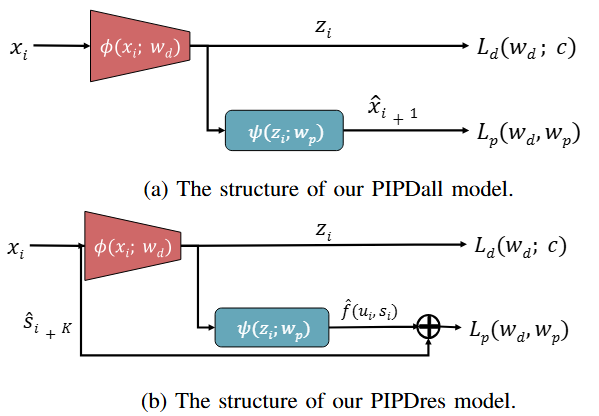
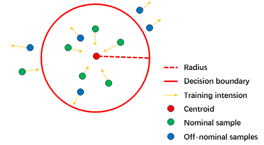
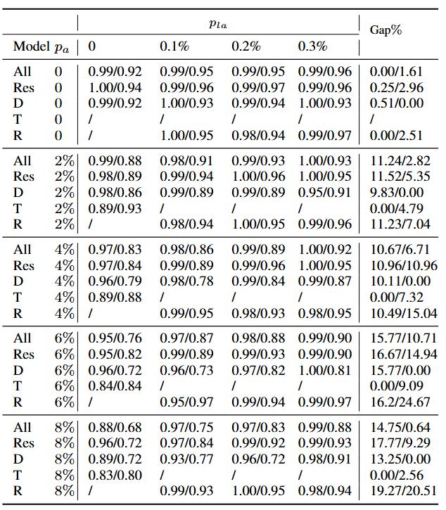
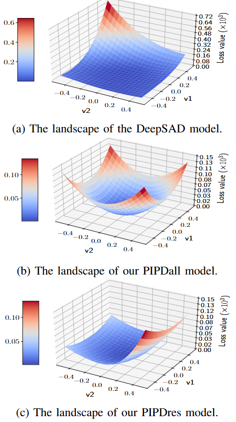

# Deep SAD: A Method for Deep Semi-Supervised Anomaly Detection
This repository provides a [PyTorch](https://pytorch.org/) implementation of the *PIAD* method presented in our IEEE RA-L paper ”Physics-informed Anomaly Detection for Unmanned Aerial Vehicles”.


## The Overall Framework


In this work, we propose a novel physics-informed anomaly detection framework called Physics-informed Prediction for Detection (PIPD) and instantiate the framework into two specific models, PIPDall and PIPDres. The core idea is to embed the dynamics of the target system into the latent space with the  prediction branch. The PIPDall model predicts all the entries at the next time step. The PIPDres model predicts only the future internal states of the target dynamic system.


The detection is based on the hypersphere in the latent space. The model is trained to minimize the volume of the hypersphere while keeping the normal data close to the center of the hypersphere and pushing the anomalies away from the center.


## Installation
To set up the environment, please install the required packages listed in `requirements.txt`:

```
pip install -r requirements.txt
```

## Traine and Evaluate
To train and evaluate the proposed models, run main_all.py and main_res.py, respectively.

To train and evaluate the baseline models, run main_SAD.py, main_RoSAS.py and main_TimesNet.py, respectively.

## Experiments
We validate our framework using emulated Global Navigation Satellite System (GNSS) spoofing attacks with linear and sinusoidal profiles, which are covered under different noise levels. The simulation results present a performance improvement of up to 17.77\% in the ROC-AUC score of our models compared to the baselines.



Unlike typical physics-informed frameworks, which often sharpen the loss landscape, our framework further smoothens it, thereby facilitating an efficient training process.



## Citation
To cite this work, please use the following BibTeX entry:
```
@article{guo2025physics,
  title={Physics-informed Anomaly Detection for Unmanned Aerial Vehicles},
  author={Guo, Yifan and Pant, Kartik A and Hwang, Inseok},
  journal={IEEE Robotics and Automation Letters},
  year={2025},
  publisher={IEEE}
}
```